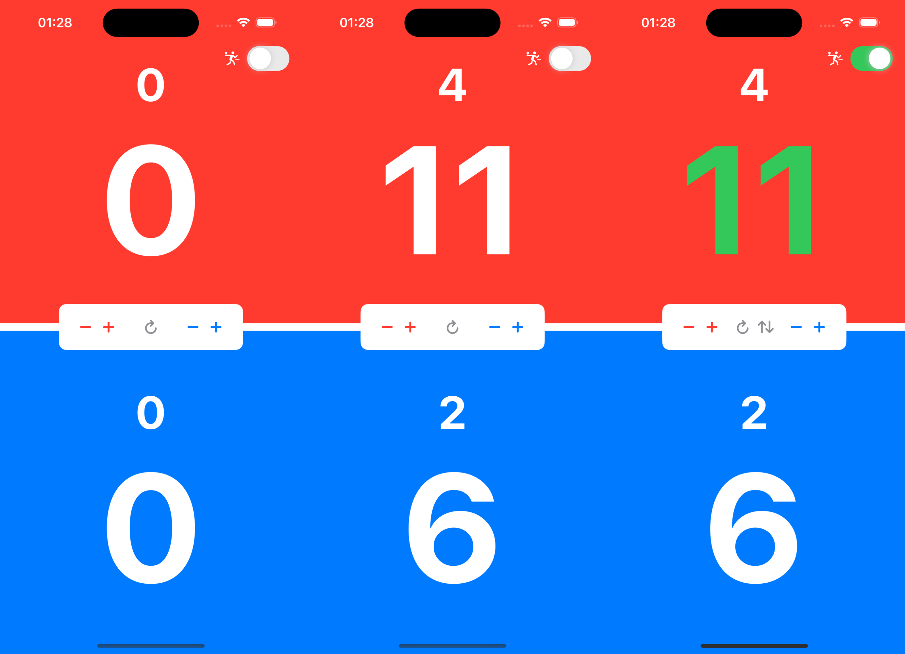

# Rws&Blue Scoreboard

## Introduction

Are you tired of complicated and advertised score apps?

This app is simple and helps you score accurately without AD!

## Preview

## Supported Platform

- iOS
- iPadOS
- MacOS (only Apple Silicon)

## Functions

- Count the scores
- Server checking system for Table Tennis

## App Store Download

## License

Green Grass is available under the `GNU General Public License v3.0`.

See the LICENSE file for more info.

## Comment for visitors

This is my first SwiftUI project.

Developer who make this app will coming back after CSAT(11/16) with large scale update.

Thank you for your interest.
